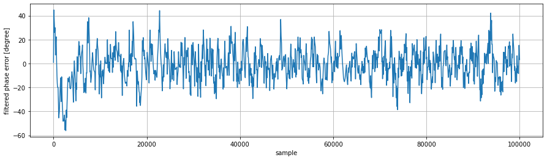

Reading the red book – decoding compact disc digital audio
==========================================================


Much has been 
[written](https://en.wikipedia.org/wiki/Compact_Disc_Digital_Audio) and 
[said](https://www.youtube.com/playlist?list=PLv0jwu7G_DFWBEyCKt4tKHIk8ez_pZS_P) about the technical details of 
compact disc digital audio, but so far, I've found no public 
record [^1] of anyone actually decoding the pits and lands on a compact disc 
to PCM samples. So I decided to do so. For an introduction on how compact discs work, I highly 
recommend the linked Wikipedia article and [Technolgy Connection's video 
series](https://www.youtube.com/playlist?list=PLv0jwu7G_DFWBEyCKt4tKHIk8ez_pZS_P).

# Ingredients

## Literature

There's a lot of secondary literature on compact disc digital audio, 
but nothing's better than getting the information straight from the horses 
mouth. In our case, this horse is called "IEC 60908 Audio recording –
Compact disc digital audio system". It's available for purchase from 
several publishers at the totally reasonable price of just €345.
Fortunately someone uploaded it to 
[archive.org](https://archive.org/details/RedBookAudioRecordingCompactDiscDigitalAudioSystemIEC60908SecondEdition199902ISBN2831846382)
, which is where such a fundamental standard belongs.
The PDF is bilingual with every other page being in french, but that's 
noting that can't be fixed with poppler's `pdfseparate` and `pdfunite`.

## Reading pits and lands

Since we don't want to read the pits and lands from the disc with a microscope[^1], we need some kind of machine that converts them to 
some form that easier to process. Luckily such machines exist in the 
form of CD players, we just need to get directly to the electrical signal from the 
optical pickup that corresponds to pits and lands on the disc and 
ignore the fact that it already decodes everything.

So I got hold of an old DVD player, put in an audio CD and started probing pins on the 
connector that connects the optical pickup to the main board. I quickly 
found a plausible-looking signal of about 300&nbsp;mVpp amplitude. 


For some reason, ~probably dust or scratches on the disc~ ([see 
later](#somethings-not-quite-right)), the signal 
sometimes drops out. To make my life easier, I captured a 4&nbsp;MSa portion of 
the signal without any dropouts at a rate of 20MSa/s[^2] and transferred it to my computer for 
further analysis in python.

# Interpolation and slicing

For reference, here's what the captured signal looks like, rendered 
using linear interpolation: 


It's important to note that this signal isn't generated by an electronic circuit, 
but rather by the pits and lands flying past the pickup.

The signal captured from the pickup is an analog two-level signal that 
we need to convert to ones and zeros for further processing. It's 
tempting to just look at each sample individually and turn it into a 
'1' if it's > 0 and to a '0' if not. However, we lose some significant 
information that way since the exact voltage at the zero crossing 
carries sub-sample timing information that comes in handy for easier 
clock recovery as it reduces jitter. One lazy way around this is to 
interpolate the acquired samples and then do the threshold detection. 


I've found that linear interpolation gives comparable results to proper 
sinc interpolation, so that's what I went with. To avoid glitches, I 
added some hysteresis to the threshold detection. The interpolation 
ratio is 20.

# Clock recovery

The first step in decoding any kind of signal without an explicit clock 
is recovering the clock from the signal itself. This usually aided by 
some kind of line coding that ensures that there are only so many 
consecutive bits without a transition. In our case the line coding is 
[Eight-to-fourteen 
modulation](https://en.wikipedia.org/wiki/Eight-to-fourteen_modulation) 
that maps one byte to 14 channel bits. It is then 
pressed onto the disc using NRZ-I (Non-return to zero inverted)
encoding, that is a '1' is encoded as a transition 
and a '0' as no transition. The combination of these two 
encodings guarantees that there are no more than 11 and no less 
than 3 unchanging consecutive bits.

This means that when looking at the signal we can't assume that the 
shortest time between two transitions is one unit interval, instead 
it's three.

The usual way of recovering the clock from a signal with an embedded 
clock is by means of a [phase-locked 
loop](https://en.wikipedia.org/wiki/Phase-locked_loop). While these are 
usually implemented in a mixed-signal circuit, implementing one in 
software can be surprisingly easy. In this instance, it can be seen as 
a discrete-time simulation that's clocked at 400 MHz, i.e. on every 
interpolated bit.

Same as with a hardware PLL we need three main components. VCO, phase 
detector and loop filter.

## VCO

A simple way of implementing a VCO in software is by means of an 
[Numerically-controlled 
oscillator](https://en.wikipedia.org/wiki/Numerically-controlled_oscillator).
Since all we need is know when to sample the input signal, the 
phase-to-amplitude converter part of the NCO can be reduced to 
detecting if the accumulator has wrapped around.

The phase accumulator is as simple as adding the frequency tuning word 
to the accumulator modulo the accumulator size on every clock cycle :

```python
acc = 0
last_acc = 0
ftw = 42
acc_size = 1000
for bit in all_bits :
    if acc < last_acc :
        # integrator has wrapped around, sample the input
    last_acc = acc
    acc = (acc+ftw)%acc_size # that's the actual NCO
```

## Phase detector

The job of the phase detector is to convert the phase difference 
between the output of the VCO and the incoming data stream into a 
proportional voltage. With the VCO being an NCO, implementing the phase detector is 
as simple as sampling the value of the phase accumulator whenever the 
input signal changes. That way, the phase detector also keeps its output 
constant in the absence of transitions at the input. To keep the sampling point 
as far away from the input transitions as possible, we want the phase of the 
VCO to be 180° at the transitions.

```python
last_bit = False
phase_delta = 0
for bit in all_bits :
    if last_bit != bit :
        phase_delta = (acc_size/2 - acc)
    last_bit = bit

```

## Loop filter

To smooth the output of the phase detector before feeding it into the 
VCO, we need some kind of low-pass filter. I went with the equivalent 
of a first order low pass since that's trivial to implement and turned 
out be good enough.

```python
last_bit = False
phase_delta = 0
delta_filtered = 0 
for bit in all_bits :
    ...
    alpha = .005
    delta_filtered = delta*alpha + delta_filtered*(1-alpha)
    ...
```

## Putting it all together

Here's how it all looks connected:


I found it really instructive to 
discover that a 
PLL-based clock recovery can be implemented in about a dozen lines of 
Python or any other imperative language without the use of any 
high-level tools such as Simulink. Apart from that it's quite 
fascinating how little it takes to implement a system that exhibits 
complex dynamic behaviour. Contrast that to other code, where the same 
number of lines just adds a couple of buttons to a window or so and 
requires calling into thousands of lines of library code.

## Making it lock

Anyone who has ever dealt with closed-loop feedback systems will tell you that 
debugging them can be really difficult since it's hard to separate 
cause from effect. 

To get around this, we first operate our PLL open-loop by setting the loop 
gain to zero. It's also worth noting that a PLL with this kind of phase 
detector that's not sensitive to frequency will have a fairly tight 
lock range, which means that we need to get the VCO center frequency 
fairly close to its nominal frequency.

After playing with the center frequency of the VCO and the loop filter 
corner frequency this is what we get:


We can see that the phase detector outputs a sawtooth waveform which 
indicates that there's a frequency offset between the VCO and input 
frequency. Closing the loop by increasing the loop gain, the PLL locks 
and the phase error becomes constant. Why constant and not zero, you 
may ask? To bring the VCO to the correct frequency, its tuning voltage, 
i.e. the output of the phase detector and loop filter must be non-zero, 
resulting in a residual phase offset. We can eliminate that offset by 
introducing and integrator the loop so that we can get a zero phase 
detector output and non-zero tuning voltage. Tweaking the integrator 
gain, we get this:




The output of the phase detector being relatively close to zero indicates that our 
PLL is working as intended so we can move on to the next step, that is 
sampling the input signal with the recovered clock. As mentioned in the 
VCO section, this is as simple as capturing the value of the input 
signal every time the phase accumulator overflows.

```python
sampled_bits = []
for bit in all_bits :
    if acc < last_acc :
        sampled_bits.append(bit)
    ...
```

This leaves us with a stream of bits that we need to make sense of.

Here's another plot to verify that the clock recovery is working as it 
should:


We see that the VCO's phase is close to 180° when the input 
transitions and thus the phase wraparounds are as far from the edges as 
they can be.

## Lock range

Now that the clock recovery was working, I was curious to see how close 
to the actual frequency I need to get the VCO's initial frequency, i.e. 
what the PLL's lock range is. The correct frequency tuning word the 
locked PLL settles on is 42.6. The minimum initial frequency tuning 
word to achieve this is 41.6, the maximum is 43.9. This results in a 
lock range of about ±2.3%. I don't know if this is particularly good or 
bad for a PLL-based clock recovery.

# NRZI decoding

As mentioned before, ones and zeros aren't encoded as-is on a CD, 
instead a '1' is econded as 
a transition and a '0' as no transition. This means it's insignificant 
whether a land on the disc is a high level or a low level. Decoding it is as simple as 
comparing each value to its predecessor:

```python
nrz_bits = [a != b for a,b in zip(sampled_bits[1:], sampled_bits)]
```

# Framing

Data on a compact disc is structured as frames of 588 channel bits:


First, we have a 24 bit long sync pattern. The sync pattern has been 
chosen in such a way that it can't appear in valid data, so we can be 
absolutely sure to have found the start of a frame if we've seen the 
sync pattern.

To extract the frames from the bitstream, we do exactly this and write 
the sync pattern as well as the following 588-24 =  564 channel bits to 
a file for further decoding. The file contains each frame encoded as 588 
`1`s and `0`s per line.

The sync word is followed by the EFM-encoded control byte and 32 
payload bytes, 24 of which are actual PCM samples and 8 of which are 
parity bytes. Each EFM-encoded byte is separated from its neighboring 
bytes by three merging bits to guarantee DC balance and meet the 
specified run length requirements. The actual value of the merging bits 
is irrelevant and isn't used in the decoding process.

See [analyze.py](/analyze.py) for the implementation of all of this.

# Frame decoding

With the frames neatly put into a file we're now safely in the digital 
realm and can start to make sense of 
the data stored in them. Since the python code for this is much less 
interesting and magic than the clock recovery, there'll be fewer code snippets throughout this section.

## Subcode

Apart from the actual PCM samples, there's metadata in the form of 
subcode on the disc. We'll deal with this first since it's simpler to 
decode than the PCM samples and it's much easier to tell if we got it right.

This is the first time where we actually have to decode the 
eight-to-fourteen modulation. Decoding it is as simple as going through 
a lookup table that maps 14 bit words to 8 bit words. The contents of 
the lookup table are given as images in the standard. Too lazy to type 
thousands of ones and zeros, I OCR'd them using tesseract and 
massaged the resulting text into a lookup table that's read from the 
python script[^3].

The subcode is stored in a way that I found confusing at first: A CD 
contains 8 channels of subcode, one of which is actually interesting.
Rather than storing the content of each subcode channel contiguously, 
The subcode byte in the frame carries 1 bit for each of the 8 subcode 
channels at once, so we get one bit for each subcode channel per frame.


The subcode itself also has some kind of framing structure, called 
blocks. Each block contains 96 payload bits. And is delimited by two 
14-bit synchronization words S₀ and S₁ that don't map to anything the EFM LUT, so 
there's no ambiguity in finding the start of a block.
 
The first (P) subcode channel encodes the start of a track and is '0' 
for the remainder of the track. The second (Q) channel is the one 
that contains data we can make sense of.

All Q-channel blocks I decoded have the ADR bits set to `0001`, meaning that the 
DATA-Q bits are to be interpreted as Mode 1:


It's a bit odd that all numbers are BCD-encoded, I guess it was done 
that way so displaying them on a 7-segment display requires the least 
amount of logic.

 - Track number: Current track on the Disc
 - Index: Tracks can be subdivided by indices, but very few discs use this
 - Min/Sec: Current run time of the track
 - Frame: Each second is subdivided into 75 frames (This frame is 
 different from the 588-bit channel frame)
 
Given that one frame of 588 channel bits contains 24 bytes of audio 
that make up 6 samples at a sample rate of 44.1 kHz, we get 
frames at a rate of 44.1kHz / 6 = 7350 frames/sec. Since it takes 98 
frames to form a block, this results in a block rate of 44.1kHz / 6 / 
98 = 75 Hz. This explains why each second is subdivided the way it is.

Decoding the data I captured, we get this:

```
Track 1.1 R=01:08:70 A=01:10:70
Track 1.1 R=01:08:71 A=01:10:71
Track 1.1 R=01:08:72 A=01:10:72
Track 1.1 R=01:08:73 A=01:10:73
Track 1.1 R=01:08:74 A=01:10:74
Track 1.1 R=01:09:00 A=01:11:00
Track 1.1 R=01:09:01 A=01:11:01
Track 1.1 R=01:09:02 A=01:11:02
Track 1.1 R=01:09:03 A=01:11:03
```

We can see that track number matches what was on the DVD player when I 
captured the waveform and that the frame number is incrementing as it 
should and wraps around at 75.

Looking good so far!

The only thing left to do is to check that the CRC is correct. The 
standard specifies the polynomial to be x¹⁶&nbsp;+&nbsp;x¹²&nbsp;+&nbsp;x⁵&nbsp;+&nbsp;1 which is 
identical to the 16-bit CRC-CCITT and that the 
parity bits are stored inverted. Feeding the CONTROL, ADR, DATA-Q and 
inverted parity bits into the CRC should yield a zero CRC.

```python
def calc_crc(bits) :
    poly = 0x1021
    crc = 0
    for bit in bits :
        if (crc>>15)&1 != bit :
            crc = ((crc<<1)&0xffff) ^ poly
        else :
            crc = ((crc<<1)&0xffff)
    return crc
```

I was both surprised and relieved when the CRC did indeed turned out to 
be zero for all blocks, since I wouldn't have had much of an idea where to start 
debugging this other than staring at the code.

## Samples

Successfully having decoded the Q-Channel subcode gave me the confidence that 
all of the previous steps, including OCR'ing the EFM LUT, were done correctly, so it's now time for the 
main event, the audio samples in glorious 16 bit linear PCM.

Revisiting the frame structure, we're now looking at the data and 
parity bytes:


Each frame contains 32 payload bytes, 24 of which are data and 8 of 
which are parity byes.

As every article on compact disc digital audio mentions, samples are 
encoded using [Cross-interleaved reed-solomon coding 
(CIRC)](https://en.wikipedia.org/wiki/Cross-interleaved_Reed%E2%80%93Solomon_coding). The 
specification helpfully provides block diagrams of the encoder and 
decoder, which I've redrawn and put side-by-side for clarity:


Tracing each byte from input to output, we see that each byte is 
subject to the same delay of 111 frames, so the data stays as-is.

The important takeaway from the encoder block diagram is that the 
reed-solomon forward error correction (FEC) in the C₁ and C₂ encoders merely tacks on extra parity bytes and leaves the 
sample data as-is. That means we can focus on deinterleaving first 
and deal with the FEC later on.

Ignoring the FEC, the decoder is exactly the inverse of the 
encoder.

Based on that knowledge, we can substitute the C₁ and C₂ decoder boxes in 
the above block with pass-throughs as indicated by the dashed lines. This leaves us 
with having to implement the various delay and reordering elements.

I implemented the delay elements as a shift register encapsulated in a 
class. Calling the `step` method returns the value from a prior 
invocation, depending on `n_delay`.

```python
class Delay:
    def __init__(self, n_delay, fill = None) :
        self.register = [fill]*n_delay
        
    def step(self, v) :
        if len(self.register) == 0 :
            return v
        r = self.register[-1]
        self.register = [v] + self.register[:-1]
        return r

d = Delay(3)
print(d.step(1)) # prints None
print(d.step(2)) # prints None
print(d.step(3)) # prints None
print(d.step(4)) # prints 1
print(d.step(5)) # prints 2
....

```

For each column of delay stages, we create a list that has the 
individual delay elements:

```python
first_delays = [Delay(0 if i%2 == 0 else 1, 0) for i in range(32)]
```

Applying the delay to all input symbols then is as simple as zipping 
them with the delay elements and calling `step` on each of them:

```python
symbols_delayed1 = [d.step(x) for d,x in zip(first_delays, symbols_in)]
```

The other delay columns work more or less identical apart from different 
delay values.

Right before the last delay columns, we need to shuffle the samples as 
indicated in the decoder diagram. Thanks to list comprehensions, that's 
a one-liner as well:

```python
# output to input sample
deinterleave_tab = ( 0, 1, 6, 7, 16, 17, 22, 23, 2, 3, 8, 9, 18, 19, 24, 25, 4, 5, 10, 11, 20, 21, 26, 27)
symbols_deinterleaved = [symbols_delayed2[i] for i in deinterleave_tab]
```

After this deinterleaving step, we get 24 bytes that form 6 consecutive 
stereo samples. All that's left to do is combine the bytes into the 
appropriate samples taking into account two's complement.

We then run this process for all frames and dump the samples into a 
wave file at 44.1&nbsp;kHz sample rate, so we get something we can 
listen to. Even though we only got about 0.8&nbsp;s of audio, it sounds 
plausible. To know if I got it all right, I ripped that particular 
track as an uncompressed wave file and imported it into Audacity. 
I aligned it to the decoded audio snippet with the help of the 
timestamps from the subcode and inverted it. Adding both tracks 
resulted in absolute silence, confirming that the decoded samples are 
indeed correct!

See [decode.py](/decode.py) for the implementation of all of this.


# Something's not quite right...

Remember that we initially captured 4&nbsp;MSa at 20&nbsp;MSa/s on the 
oscilloscope? This 
corresponds to a record length of 0.2&nbsp;s. However, we got 0.78&nbsp; 
seconds of audio. Since compact disc digital audio operates in real 
time, this is doesn't quite add up. The frequency tuning word from the 
PLL backs this up: The raw bit rate of a compact disc should be: 
44.1&nbsp;kHz / 6 samples per frame × 588 bits per frame = 
4.3218&nbsp;MBit/s. However, the bit rate as per the VCO frequency is 
42.6 / 1000 × 20&nbsp;MSa/s × 20 = 17.04&nbsp;MBit/s. Multiplying this 
by the ratio between the oscilloscope record length and the length 
of the decoded audio, we get: 17.04&nbsp;MBit/s × (0.2&nbsp;s / 
0.78&nbsp;s) = 4.33&nbsp;MBit/s, which is fairly close to the expected 
bit rate, so at least that that checks out.

All of this didn't quite make sense at first. If the DVD player is 
reading the disc about 4× faster than it needs to, where's that data 
going? Then I remembered the dropouts I initially saw on the 
oscilloscope. Maybe these dropouts aren't actually dust or scratches, 
but the DVD player too fast to and then jumping 
back on the disc to maintain the 
correct data rate on average?

To find out if that's the case, I captured another portion of the 
waveform that has such a dropout:


At first attempt, the clock recovery PLL didn't relock after the first
dropout and stayed unlocked thereafter. Looking at the PLL's signals, I 
found out that the integrator went off the rails during the dropout to 
the point where it was so far off that the PLL had no chance of ever 
locking again. Clamping the magnitude of the integrator value to 
slightly above its nominal value did the trick to get the PLL to relock 
after the dropouts.

With that obstacle out of the way we can decode the Q-Channel subcode 
as before:

```
[...]
Track 2.1 R=00:17:45 A=06:32:53
Track 2.1 R=00:17:46 A=06:32:54
Track 2.1 R=00:17:47 A=06:32:55
CRC error
Track 2.1 R=00:17:27 A=06:32:35
Track 2.1 R=00:17:28 A=06:32:36
Track 2.1 R=00:17:29 A=06:32:37
[...]
Track 2.1 R=00:17:45 A=06:32:53
Track 2.1 R=00:17:46 A=06:32:54
Track 2.1 R=00:17:47 A=06:32:55
CRC error
Track 2.1 R=00:17:27 A=06:32:35
Track 2.1 R=00:17:28 A=06:32:36
Track 2.1 R=00:17:29 A=06:32:37
[...]
Track 2.1 R=00:17:45 A=06:32:53
Track 2.1 R=00:17:46 A=06:32:54
Track 2.1 R=00:17:47 A=06:32:55
CRC error
Track 2.1 R=00:17:27 A=06:32:35
Track 2.1 R=00:17:28 A=06:32:36
Track 2.1 R=00:17:29 A=06:32:37
```

Based on time codes, we can see that the DVD player is indeed reading 
the same part of the disc multiple times. Suspicion confirmed!

My best guess for why the DVD player isn't reading the disc at the 
nominal rate is that the signal conditioning and clock recovery circuitry in the 
SoC can't handle the nominal rate since it also has to 
process the significantly faster signal from a DVD.

# Closing thoughts

Decoding compact disc digital audio from the pickup signal to PCM 
samples was a really interesting project and was surprisingly easy 
after getting the clock recovery right and fixing a couple of stupid 
bugs in the deinterleaver. It's also worth noting that this project 
only required a digital oscilloscope with half-decent memory depth, a CD 
player and some basic DSP and bit shuffling knowledge, so I'm wondering 
why I haven't found much evidence of people having done this before.

One thing that I didn't cover is implementing the Reed-Solomon 
decoder. That'll has to wait until I've developed a better 
understanding of Reed-Solomon forward error correction.


[^1]: While writing this article, a friend of mine pointed me to 
[this](http://www.pmonta.com/compact-disc-microscopy.html) post where 
someone did just that!

[^2]: In the process of implementing the clock recovery, I was scratching my 
head why I was seeing lots of jitter on the acquired signal. Turns out 
that Keysight InfiniiVision oscilloscopes by default randomize the the 
time between samples at low sample rates to prevent aliasing. Turning 
off the antialiasing option in the display menu indeed fixed the 
problem. Another thing worth mentioning is that one needs to press the 
single shot button to get maximum memory depth on this series of 
oscilloscopes. Just pressing stop only yields half the memory depth.

[^3]: Only later I discovered that the freely available [ECMA-130 
Standard](https://www.ecma-international.org/wp-content/uploads/ECMA-130_2nd_edition_june_1996.pdf)
for CD-ROM includes a textual representation of the EFM LUT.
